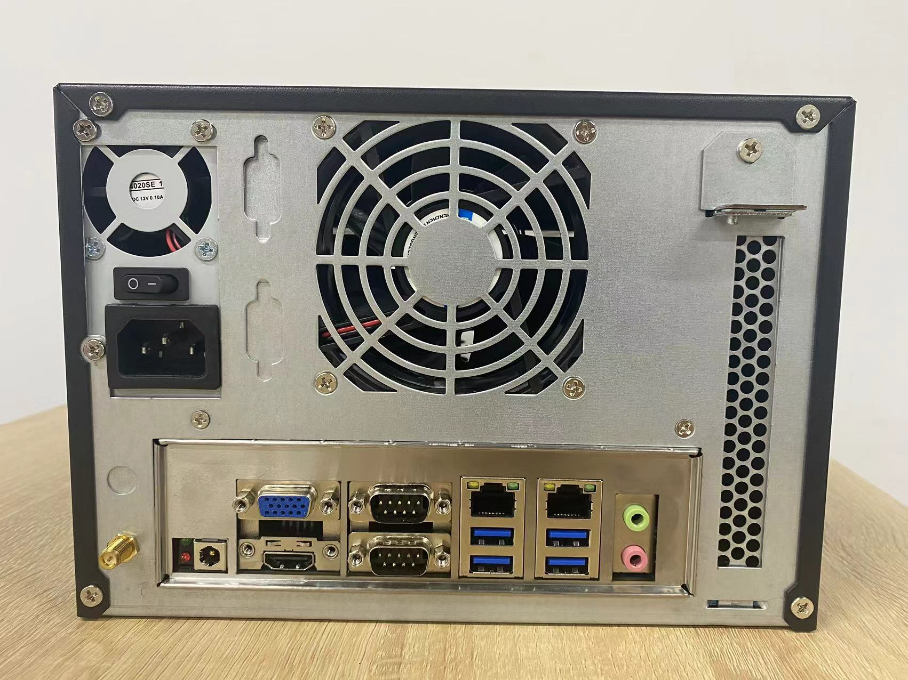

# Video-Server-NVR-Box-with-Networkoptix-Server
This repository is the documentation for RK3588 products, written by RSD Team of HYY Technology Co.,Ltd.

# Introduction
High-performance video server in mini format

- Rockchip RK3588/4GB Ram(8GB option)
- Ubuntu Linux OS (Debian option)
- 2 x 3.5" SATA (3.0Gb/s, not included) max. 10TB
- 1 x 16GB Micro SD Card
- 4GB DDR4(8GB option)
- 4 x USB 3.0
- 1 x HDMI
- 1 x VGA
- 2 x RJ45 LAN port (1000/100/10BASET)

# Product Pictures

# MainBoard

# Contacts

- Website: www.we-signage.com
- https://we-signage.en.made-in-china.com/
- E-mail: dennis@we-signage.com
- MP/Whatsapp/Wechat: + 86 13349909990
- Skype: solled686